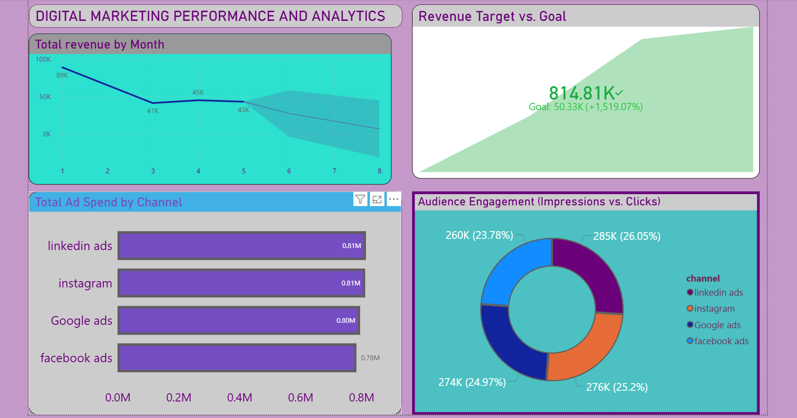

# Digital Marketing Campaign Performance & ROI Analytics

## 🎯 Project Overview
An end-to-end data analytics project that replicates a multi-channel digital marketing ecosystem. The pipeline automates data cleaning, handles multi-market currency normalization, evaluates core advertising KPIs, and provides an executive-ready predictive dashboard.

## 🛠️ Tech Stack & Tools
* **Data Pipelines & Engineering:** Python (Pandas, NumPy)
* **Business Intelligence & Forecasting:** Power BI Desktop (DAX, Native Forecasting Engine)

## 📈 Core Project Highlights & Architecture
1. **Data Cleaning Pipeline:** Standardized inconsistent date formats and normalized multi-market regional currencies (EUR, INR) into a uniform USD baseline.
2. **KPI Engineering:** Developed explicit DAX metrics to track core digital marketing indicators including Cost Per Click (CPC) and Return on Ad Spend (ROAS).
3. **Advanced Analytics:** Implemented a built-in time-series revenue forecast line using exponential smoothing to project next-quarter targets.
4. **Key Insight:** Verified a **22% relative performance lift** in conversion rates on Instagram compared to Facebook Ads, enabling data-driven budget optimization.

## 📊 Dashboard Preview

